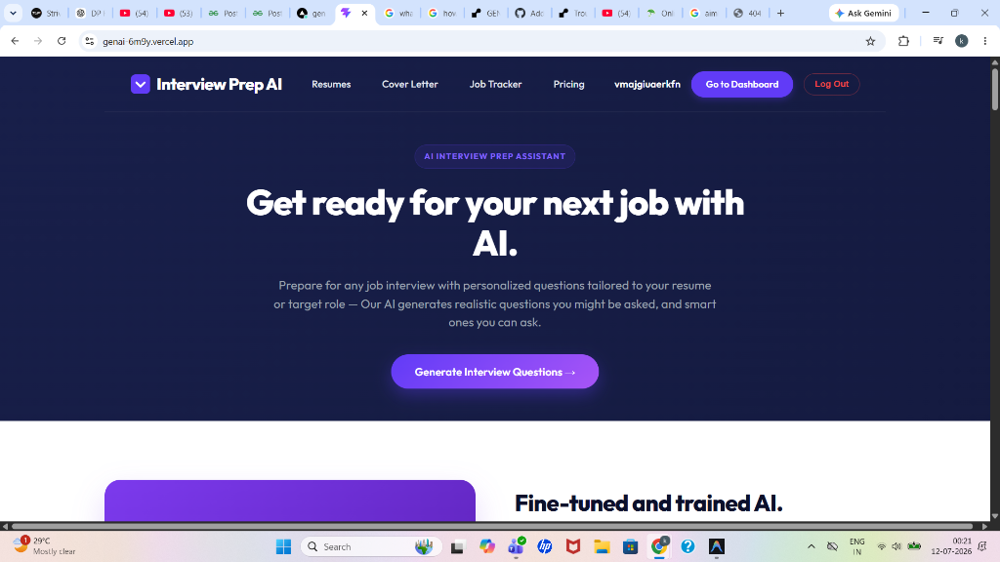
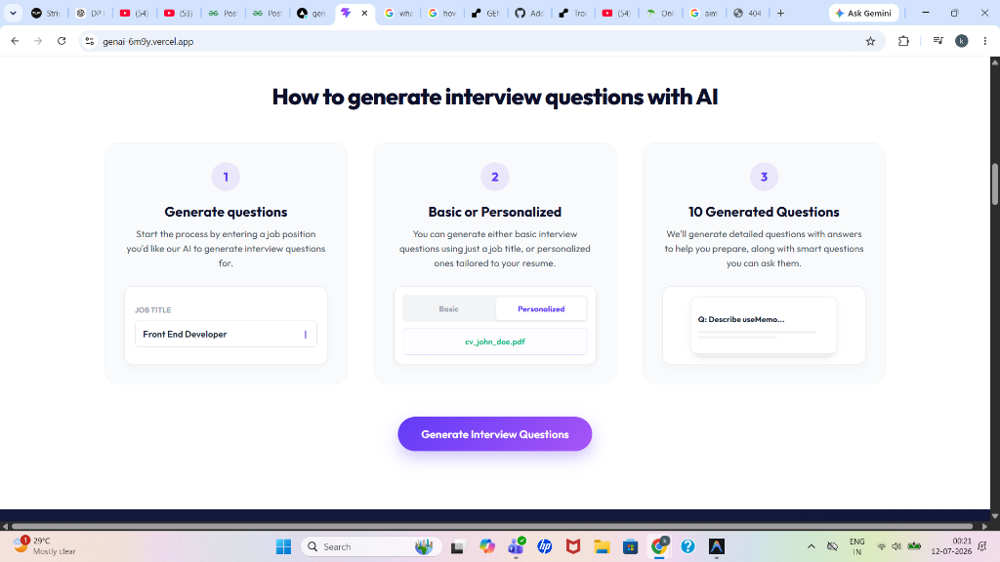
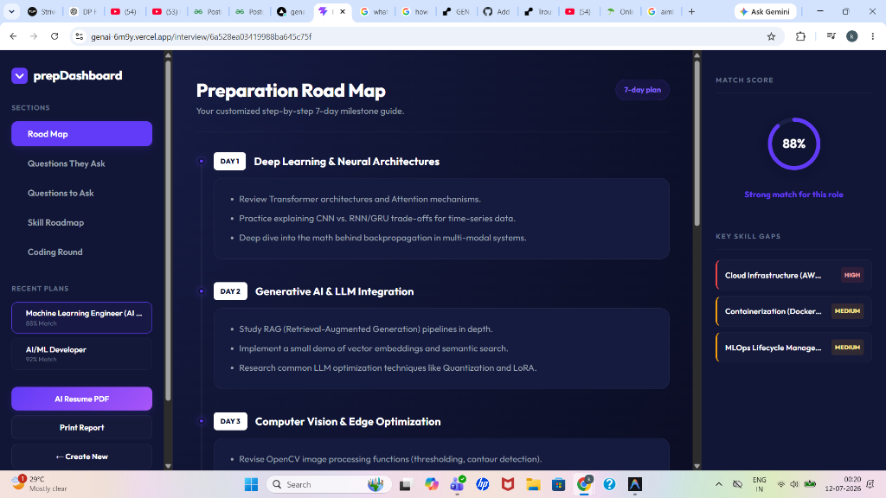
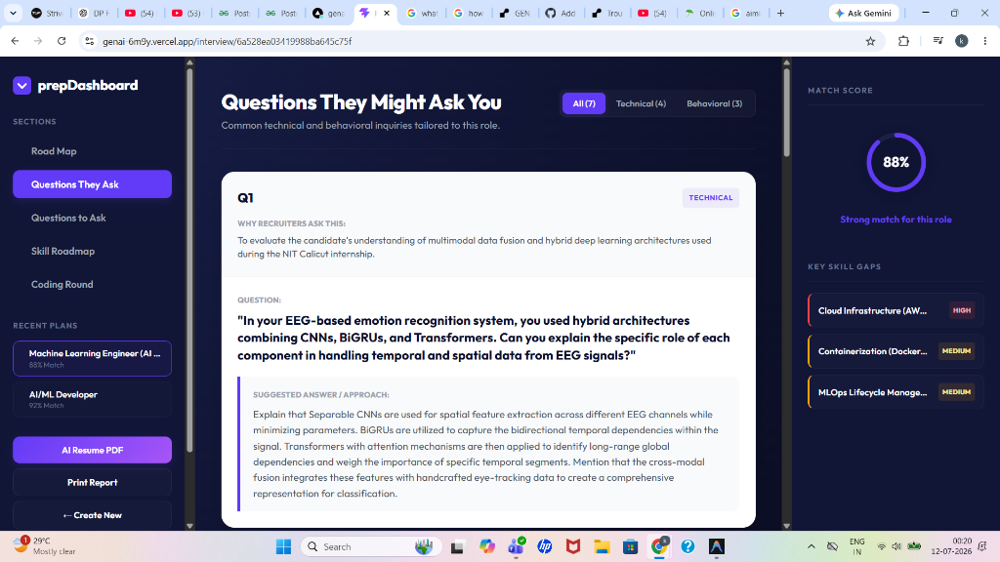
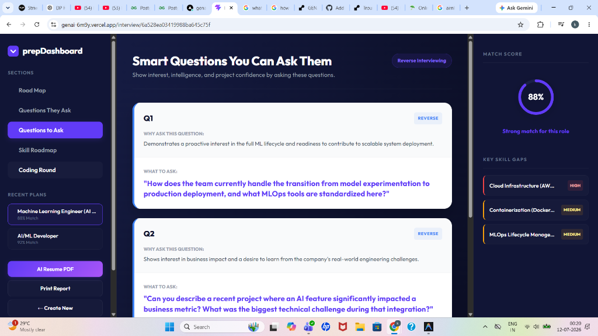

# Interview Prep AI 🤖

**Interview Prep AI** is a decoupled, professional MERN stack application designed to democratize career preparation. By leveraging state-of-the-art Google Gemini Generative AI and automated headless browsers, the platform allows candidates to analyze resumes against target job descriptions, receive tailored 7-day preparation roadmaps, undergo interactive mock interviews with real-time AI feedback, and generate print-ready tailored resumes and cover letters.

- **Live Frontend (Vercel)**: [https://genai-6m9y.vercel.app](https://genai-6m9y.vercel.app)
- **Live Backend API (Render)**: [https://genai-wly7.onrender.com](https://genai-wly7.onrender.com)

---

## 📸 Platform Showcase

### 1. Landing Portal & Interactive Guide



### 2. Personalized 7-Day Prep Roadmap


### 3. Role-Specific Technical & Behavioral Questions


### 4. Smart Reverse-Interviewing Recommender


---

## 🏗️ System Architecture

The application is built on a decoupled MERN-like architecture. The client is a React SPA optimized for speed, which connects securely to an Express API server. The backend handles computationally heavy processes such as resume parsing, AI analysis, and print-ready PDF generation.

```mermaid
graph TD
    subgraph Client (Vite + React)
        User[Browser Viewport] <--> SPA[React SPA / React Router v7]
        SPA --> Axios[Axios API Client]
        Axios --> LocalStorage[(Local Cache / JWT)]
    end

    subgraph Server (Node.js + Express)
        Axios <--> API[Express Router]
        API --> AuthMW[JWT Auth Middleware]
        API --> Controllers[Route Controllers]
        Controllers <--> Services[AI Service / Puppeteer]
    end

    subgraph Data & Cloud Services
        Controllers <--> DB[(MongoDB Atlas)]
        Services <--> Gemini[Google GenAI API]
        Services <--> HeadlessBrowser[Puppeteer Headless]
    end
```

---

## 🚀 Key Features & Deep Dive

### 1. ATS-Friendly Tailored Resume & PDF Generation
When a user requests a tailored resume, Gemini generates custom print-ready HTML matching the target job description. The Express backend launches a headless Chromium instance via **Puppeteer** in a containerized environment, renders the HTML layout, and outputs a print-ready A4 binary PDF stream directly to the browser blob client.

### 2. Interactive Mock Interview Sessions & AI Feedback
Users can undergo mock interviews based on the generated report questions. An interactive UI records answers, which are then evaluated against a strict JSON schema by Gemini. The evaluation provides:
*   A scoring metric (0-100)
*   Highlighted strengths of the answer
*   Actionable areas for improvement
*   A concise, expert model answer for comparison

### 3. Caching & Deduplication Layers
To minimize slow API roundtrips and conserve Gemini API quota, the system implements:
*   **Client-side Local Caching**: Computes content hashes of text inputs and checks `localStorage` before initiating new API requests.
*   **Server-side MongoDB Cache**: Deduplicates identical requests (same resume, self-description, and job requirements) by storing and serving previously generated reports.

---

## 📂 Directory Structure

```text
GENAI/
├── package.json                   # Root workspace configurations
├── vercel.json                    # Vercel SPA routing rules
├── assets/                        # Showcase media files
├── Frontend/                      # Client-side React Application
│   ├── vite.config.js
│   ├── package.json
│   └── src/
│       ├── App.jsx
│       ├── app.routes.jsx         # Client-side routing definitions
│       └── features/
│           ├── auth/              # Signup, login, and token refresh
│           └── interview/         # Roadmaps, questions, cover letters, and tracking
└── Backend/                       # Server-side API Application
    ├── server.js                  # Entry point & Mongoose initialization
    ├── package.json
    └── src/
        ├── app.js                 # Middleware, CORS, and route bindings
        ├── controllers/           # Route handler controllers
        ├── middlewares/           # Security, upload, & rate limiters
        ├── models/                # MongoDB Mongoose schemas
        └── services/              # Gemini AI bindings & Puppeteer compiler
```

---

## 💾 Database Models & Schemas

### 1. User Schema (`user.model.js`)
Stores authentication data securely. Passwords are encrypted using `bcryptjs` before storage.
```javascript
const userSchema = new mongoose.Schema({
    username: { type: String, required: true, unique: true },
    email: { type: String, required: true, unique: true },
    password: { type: String, required: true }
}, { timestamps: true });
```

### 2. Interview Report Schema (`interviewReport.model.js`)
Caches the full AI evaluation, including extracted resume content, preparation plans, and generated HTML.
```javascript
const interviewReportSchema = new mongoose.Schema({
    user: { type: mongoose.Schema.Types.ObjectId, ref: 'user', required: true },
    resume: { type: String }, 
    selfDescription: { type: String },
    jobDescription: { type: String },
    matchScore: { type: Number },
    title: { type: String },
    technicalQuestions: [{ intention: String, question: String, answer: String }],
    behavioralQuestions: [{ intention: String, question: String, answer: String }],
    questionsToAsk: [{ question: String, intention: String }],
    skillGaps: [{ skill: String, severity: { type: String, enum: ['low', 'medium', 'high'] } }],
    preparationPlan: [{ day: Number, focus: String, tasks: [String] }],
    resumeHtml: { type: String } 
}, { timestamps: true });
```

---

## 🔌 API Endpoints Documentation

### Authentication (`/api/auth`)
*   `POST /api/auth/register` - Registers a new user. Expects `username`, `email`, and `password`.
*   `POST /api/auth/login` - Authenticates user. Returns access token and sets secure cookies.
*   `GET /api/auth/logout` - Revokes current session token and adds it to the blacklist.
*   `POST /api/auth/refresh` - Rotates expired access tokens using the refresh cookie.
*   `GET /api/auth/get-me` - Fetches the authenticated user profile.

### AI Interview Prep (`/api/interview`)
*   `POST /api/interview/` - Generates a new interview report. Accepts `jobDescription`, `selfDescription`, and `resume` (PDF file upload via `multipart/form-data`).
*   `GET /api/interview/` - Retrieves all interview reports for the current user.
*   `GET /api/interview/report/:id` - Fetches a specific report by ID.
*   `POST /api/interview/resume/pdf/:id` - Generates and returns the print-ready tailored resume PDF file stream.
*   `POST /api/interview/roadmap/:id` - Compiles a detailed skills roadmap.

### Interactive Mock Sessions (`/api/mock-session`)
*   `POST /api/mock-session/evaluate` - Evaluates a mock answer. Expects `question`, `userAnswer`, and `questionType`.
*   `POST /api/mock-session/stream` - Initiates Server-Sent Events (SSE) AI streaming response.

---

## 🛠️ Environment Configuration

Set up these variables in your local `.env` files or platform dashboards:

| Environment Variable | Target Platform | Description |
| :--- | :--- | :--- |
| `NODE_ENV` | Backend | Set to `production` in live environments to activate secure cross-origin cookies. |
| `MONGO_URI` | Backend | MongoDB connection string (local or MongoDB Atlas). |
| `JWT_SECRET` | Backend | Secure random string used to encrypt JWT tokens. |
| `GOOGLE_GENAI_API_KEY` | Backend | Your Google Gemini API Key. |
| `FRONTEND_URL` | Backend | The production URL of the frontend (e.g. `https://your-app.vercel.app`) without trailing slash. |
| `VITE_API_URL` | Frontend | The production URL of the backend (e.g. `https://your-backend.onrender.com`) without trailing slash. |
| `PUPPETEER_SKIP_CHROMIUM_DOWNLOAD` | Backend (Render) | Set to `true` on Render to avoid downloading Chromium during build time. |
| `PUPPETEER_EXECUTABLE_PATH` | Backend (Render) | Set to `/usr/bin/google-chrome-stable` on Render to use pre-installed Chrome. |

---

## 💻 Local Installation & Setup

### 1. Clone & Workspace Setup
```bash
git clone https://github.com/kavisha2035/GENAI.git
cd GENAI
```

### 2. Automated Dependency Installation
Install all root, backend, and frontend dependencies with a single command:
```bash
npm install
```

### 3. Environment Setup
Create a `.env` file in the `Backend` directory and fill in the values described in the **Environment Configuration** section.

### 4. Run Development Servers
Launch both servers concurrently:
```bash
npm run dev
```
*   Frontend Dev URL: [http://localhost:5173](http://localhost:5173)
*   Backend API URL: [http://localhost:3000](http://localhost:3000)

### 5. Build for Production
```bash
npm run build
```
This command compiles the React assets into the static `Frontend/dist` folder, which can then be served by the backend or uploaded directly to host providers.
